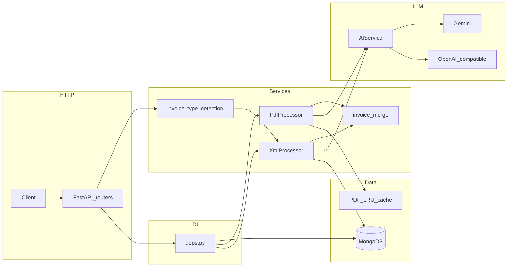

# Extrator de dados — NFe e NFS-e (XML + PDF)

API **FastAPI** assíncrona que processa **XML de NFe (produto)** ou **NFS-e (serviço)** e **PDF** (DANFE ou nota de serviço) com fluxo híbrido: regras/XPath com cache em **MongoDB** e **LLM** só quando necessário (novo layout XML ou PDF com baixa qualidade de texto). O LLM pode ser **OpenAI** (API ou endpoint compatível com Chat Completions) ou **Google Gemini** (Google AI Studio), configurável por `LLM_PROVIDER`.

## Requisitos

- Python 3.11+
- MongoDB (ou apenas Docker Compose)
- Credenciais do provedor escolhido (`OPENAI_API_KEY` ou `GEMINI_API_KEY`) — opcional: sem chave, o XML usa cache ou mapeamento padrão por tipo e o PDF segue heurísticas determinísticas quando possível

## Execução local

```bash
python -m venv .venv
source .venv/bin/activate
pip install -e ".[dev]"
cp .env.example .env
# Edite .env: MONGODB_URL, LLM_PROVIDER, OPENAI_* ou GEMINI_*
uvicorn app.main:app --reload --host 0.0.0.0 --port 8000
```

Ou:

```bash
python main.py
```

## Docker Compose

```bash
OPENAI_API_KEY=sua-chave docker compose up --build
```

Ou use um arquivo `.env` na raiz (não versionado) com as variáveis necessárias e execute `docker compose up --build` (Compose interpola variáveis do host em `docker-compose.yml`).

- API: `http://localhost:8000`
- Documentação: `http://localhost:8000/docs`
- Health: `GET /health`

**Nota:** no `docker-compose.yml`, `ENABLE_PDF_EXTRACT_ENDPOINT` tem **valor por defeito `true`** no serviço `api` (para testar `POST /extract-pdf` no Swagger). No [`.env.example`](.env.example) o defeito é `false`. Para desactivar o endpoint só-PDF em Compose, defina no `.env` `ENABLE_PDF_EXTRACT_ENDPOINT=false`.

## Variáveis de ambiente

Ver [`.env.example`](.env.example). Principais:

| Variável | Descrição |
|----------|-----------|
| `MONGODB_URL` | URI do MongoDB |
| `MONGODB_DB` | Nome do banco |
| `LLM_PROVIDER` | `openai` (predefinido) ou `gemini` |
| `OPENAI_API_KEY` | Chave OpenAI / compatível (usada quando `LLM_PROVIDER=openai`; vazia = sem LLM nesse modo) |
| `OPENAI_BASE_URL` | Base URL compatível OpenAI |
| `OPENAI_MODEL` | Modelo |
| `GEMINI_API_KEY` | Chave Google AI Studio (quando `LLM_PROVIDER=gemini`) |
| `GEMINI_MODEL` | Modelo Gemini |
| `GEMINI_BASE_URL` | Base URL da API Gemini |
| `MAX_UPLOAD_BYTES` | Tamanho máximo por arquivo |
| `PDF_CACHE_MAX_ENTRIES` | LRU em memória para resultados de PDF (por tipo + hash do arquivo) |
| `STORE_PROCESSED_METADATA` | Gravar metadados em `processed_invoices` |
| `ENABLE_PDF_EXTRACT_ENDPOINT` | Se `true`, regista `POST /extract-pdf` (só PDF, testes/depuração) |
| `TESTING` | `true` desliga Mongo no lifespan (pytest) |
| `LOG_LEVEL` | Nível de log |

Sem credenciais válidas para o **provedor activo**, o LLM não é chamado; o XML usa mapeamento em cache ou padrão por tipo.

## Endpoints

### `POST /process-invoice`

`multipart/form-data`:

- `xml_file`: arquivo `.xml` (NFe ou NFS-e)
- `pdf_file`: arquivo `.pdf`

#### Exemplo com curl

```bash
curl -s -X POST "http://localhost:8000/process-invoice" \
  -H "X-Request-ID: meu-id-opcional" \
  -F "xml_file=@/caminho/nota.xml;type=application/xml" \
  -F "pdf_file=@/caminho/danfe.pdf;type=application/pdf"
```

#### Resposta JSON (schema unificado)

| Campo | Descrição |
|-------|-----------|
| `invoice_type` | `"nfe"` ou `"nfse"` (detecção automática pelo XML) |
| `issuer` / `receiver` | Emitente/prestador e destinatário/tomador |
| `items` | Lista de linhas: produtos (NFe) ou serviços (NFS-e) |
| `total_value` | Valor total |
| `taxes` | `icms`, `ipi`, `iss`, `pis`, `cofins`, etc. (o que existir no documento) |
| `date` | Data de emissão (ou competência, conforme XML) |
| `invoice_number` | Número da nota |
| `structure_hash` | Fingerprint estrutural do XML (inclui o tipo) |
| `used_llm_xml` / `used_llm_pdf` | Se o LLM foi usado em cada etapa |
| `warnings` | Avisos (ex.: falha parcial no PDF) |
| `extraction_sources` | Origem do mapeamento XML (`cached` / `llm` / `default`) e do PDF (`deterministic` / `llm`) |

**Breaking change:** o campo `products` foi substituído por **`items`** na resposta.

Exemplos mínimos de XML estão em [`tests/fixtures/minimal_nfe.xml`](tests/fixtures/minimal_nfe.xml) e [`tests/fixtures/minimal_nfse.xml`](tests/fixtures/minimal_nfse.xml).

### `POST /extract-pdf` (opcional)

Extracção **apenas do PDF** (PyMuPDF + heurísticas; LLM opcional). A rota **só é registada** se `ENABLE_PDF_EXTRACT_ENDPOINT=true` (reiniciar a API após alterar a variável). No Swagger, aparece na tag **pdf**.

Query parameters:

- `invoice_type`: `nfe` ou `nfse` (prompts e heurísticas)
- `skip_llm`: se `true`, não chama o LLM no PDF
- `simulate_xml_complete`: simula cobertura XML completa ou vazia (afecta quando o LLM do PDF é acionado)

Body: `multipart/form-data` com `pdf_file` (`.pdf`).

#### Exemplo com curl

```bash
curl -s -X POST "http://localhost:8000/extract-pdf?invoice_type=nfe&skip_llm=false&simulate_xml_complete=false" \
  -H "X-Request-ID: debug-pdf" \
  -F "pdf_file=@/caminho/danfe.pdf;type=application/pdf"
```

## Comportamento resumido

1. **Detecção:** o XML é classificado como NFe ou NFS-e (tags raiz, namespaces, presença de prestador/tomador/serviço/ISS, etc.).
2. **XML:** calcula fingerprint estrutural **por tipo** → busca `xml_mappings` no Mongo (`structure_hash` + `invoice_type`) → se não existir e houver credenciais LLM para o provedor activo, envia amostra do XML ao modelo com prompt específico (NFe ou NFS-e); persiste o mapeamento; extrai dados com `lxml`.
3. **PDF:** extrai texto com **PyMuPDF**; heurística de qualidade (com reforço para NFS-e: ISS, serviço, etc.); se necessário (e houver credenciais), envia texto ao LLM com prompt NFe ou NFS-e.
4. **Fusão:** prioriza dados do XML; PDF preenche lacunas (incluindo `iss` no PDF quando o XML não trouxer).

Documentos antigos em `xml_mappings` **sem** `invoice_type` são tratados como **NFe** na leitura.

**OCR** não está incluído: PDFs somente imagem tendem a baixa qualidade de texto e o LLM receberá pouco conteúdo. (Extensão futura: **pdfplumber** para tabelas em layouts muito tabulares.)

## Testes

```bash
TESTING=1 STORE_PROCESSED_METADATA=false pytest -q
```

`TESTING=true` evita conectar ao Mongo no lifespan dos testes que sobrescrevem dependências.

## System design

### Visão em camadas

- **HTTP:** FastAPI, middleware global que propaga `X-Request-ID` (cabeçalho opcional na entrada, sempre presente na resposta).
- **Roteamento:** [`app/api/routers/invoice.py`](app/api/routers/invoice.py) (`/process-invoice`, `/health`); [`app/api/routers/pdf_extract.py`](app/api/routers/pdf_extract.py) (`/extract-pdf`) condicionado a `ENABLE_PDF_EXTRACT_ENDPOINT`.
- **Injeção de dependências:** [`app/api/deps.py`](app/api/deps.py) — `Settings`, `AsyncIOMotorDatabase`, repositórios Mongo, `AIService`, `XmlProcessor`, `PdfProcessor`.
- **Domínio:** detecção de tipo ([`invoice_type_detection.py`](app/services/invoice_type_detection.py)), processamento XML ([`xml_processor.py`](app/services/xml_processor.py), serviços NFe/NFS-e), PDF ([`pdf_processor.py`](app/services/pdf_processor.py)), fusão XML-first ([`invoice_merge.py`](app/services/invoice_merge.py)).
- **Persistência:** Motor — `XmlMappingRepository`, `ProcessedInvoiceRepository` ([`app/db/repositories.py`](app/db/repositories.py)).

### LLM

Interface [`AIService`](app/services/ai_service.py) (`complete_json` com resposta validada por schema Pydantic). Implementações: [`OpenAICompatibleAIService`](app/services/openai_ai_service.py) e [`GeminiAIService`](app/services/gemini_ai_service.py). Seleção por `LLM_PROVIDER` em `get_ai_service`. [`NullAIService`](app/services/ai_service.py) existe para cenários em que o LLM não deve ser usado (ex.: testes).

### Dados e cache

- **XML:** fingerprint estrutural + `invoice_type` como chave lógica; mapeamentos XPath persistidos em Mongo (`xml_mappings`).
- **PDF:** cache LRU em memória limitado por `PDF_CACHE_MAX_ENTRIES` (chave por tipo + hash do ficheiro).
- **Fusão:** prioridade ao lado XML; PDF completa campos em falta.

### Lifecycle da aplicação

[`app/main.py`](app/main.py): com `TESTING=true`, o lifespan não abre Mongo. Caso contrário, `mongo_lifespan` inicializa a ligação e `app.state.db` fica disponível para `get_db`.



## Estrutura

```
app/
  main.py
  config.py
  api/
    deps.py
    validators.py
    routers/
      invoice.py
      pdf_extract.py
  services/
    ai_service.py
    openai_ai_service.py
    gemini_ai_service.py
    invoice_type_detection.py
    invoice_processors.py
    invoice_merge.py
    nfe_xml_service.py
    nfse_xml_service.py
    xml_processor.py
    xml_extract_common.py
    pdf_processor.py
    prompts.py
    llm_text.py
  models/
    domain.py
    invoice_types.py
    ai_schemas.py
    pdf_extract.py
  db/
    mongo.py
    repositories.py
  utils/
    xml_fingerprint.py
    xml_sample.py
    hashing.py
    logging.py
main.py
tests/
  conftest.py
  fixtures/
    minimal_nfe.xml
    minimal_nfse.xml
  test_*.py
```
